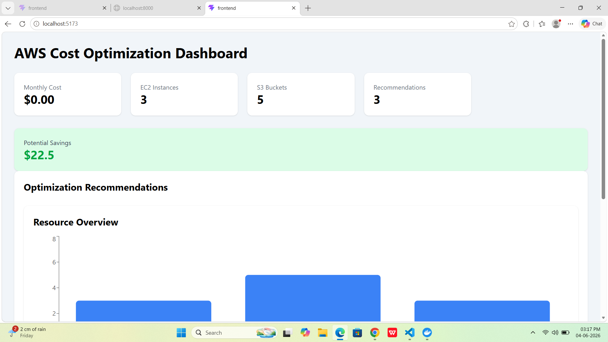
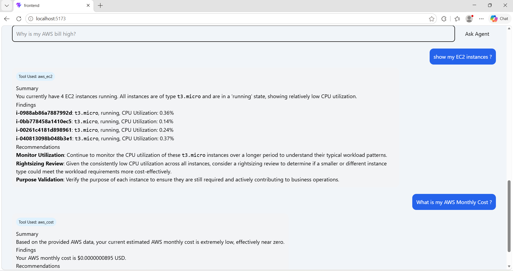
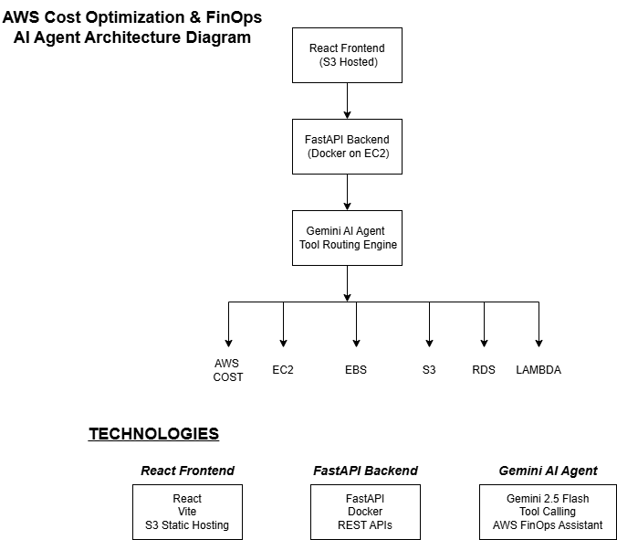
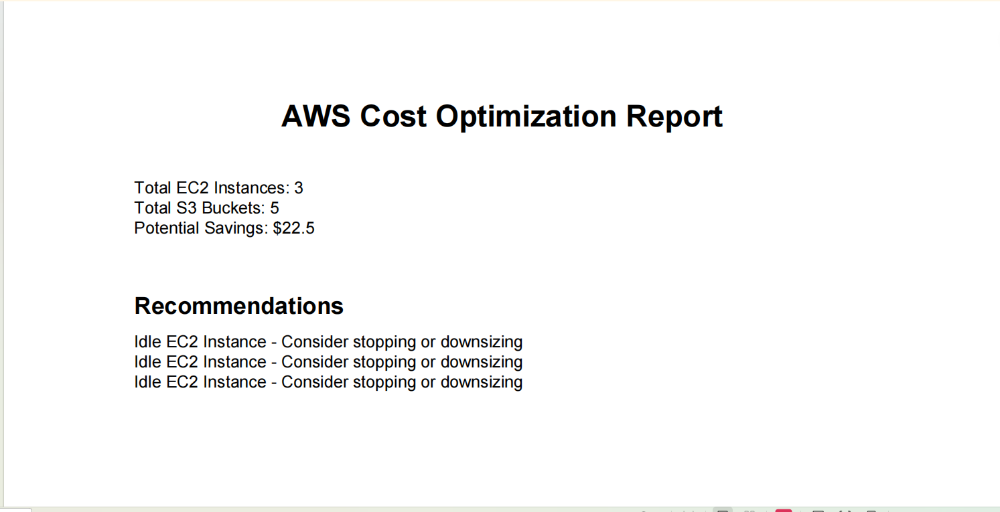
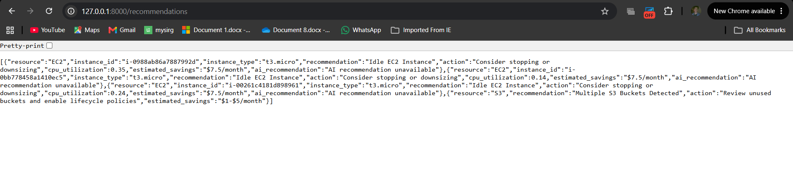
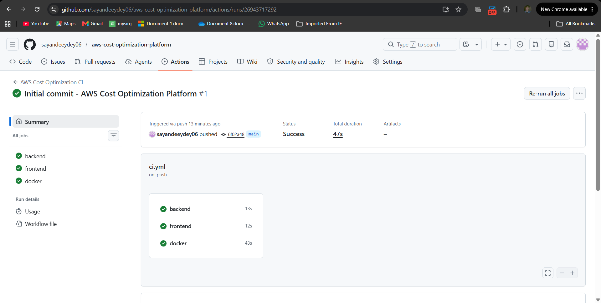

# AWS Cost Optimization Platform

A full-stack cloud cost optimization platform that analyzes AWS resources, identifies cost-saving opportunities, and generates actionable recommendations through an interactive dashboard.

## Dashboard Preview




## AI Assistant




## Architecture Diagram



### PDF Report



### Recommendations



### CI/CD PIPELINE




## Features

* AWS Cost Explorer Integration
* EC2 Resource Discovery
* CloudWatch CPU Utilization Analysis
* EBS Volume Analysis
* S3 Bucket Discovery
* Cost Optimization Recommendations
* AI-Powered AWS Assistant
* PDF Report Generation
* Interactive React Dashboard
* Docker Containerization
* GitHub Actions CI/CD Pipeline

---

### Project Metrics
* 5+ AWS Services Integrated
* AI-Powered Cost Analysis
* Dockerized Deployment
* GitHub Actions CI/CD
* Real-Time Resource Discovery
* Executive PDF Reporting

## Architecture

```text
React Dashboard (S3)
       │
       ▼
FastAPI Backend (Docker on EC2)
       │
       ▼
AWS Services
 ├── Cost Explorer 
 ├── EC2 
 ├── CloudWatch 
 ├── EBS 
 ├── S3 
 └── Gemini AI Agent
```

### AI Agent Capabilities

The AI assistant can answer:

* What is my AWS monthly cost?
* Show my EC2 instances
* List unattached EBS volumes
* Show S3 buckets
* Give AWS cost optimization recommendations

The AI Agent uses:

* Google Gemini 2.5 Flash
* LangChain Tool Calling
* AWS SDK (Boto3)

to dynamically fetch AWS account information and generate FinOps recommendations.

### Example Questions

Try asking:

* What is my AWS monthly cost?
* Show all EC2 instances
* List unattached EBS volumes
* Show my S3 buckets
* Give AWS cost optimization recommendations

---

## Tech Stack

### Frontend

* React.js
* Axios
* Recharts
* Tailwind CSS

### Backend

* FastAPI
* Python
* Boto3
* ReportLab

### AI Layer
* Google Gemini 2.5 Flash
* LangChain Tool Calling

### AWS Services

* AWS Cost Explorer
* Amazon EC2
* Amazon S3
* Amazon EBS
* Amazon CloudWatch

### DevOps

* Docker
* GitHub Actions
* Git

---

## Dashboard Features

### Cost Monitoring

* Monthly AWS cost tracking
* Resource utilization insights

### Resource Discovery

* EC2 instance inventory
* S3 bucket inventory
* Unattached EBS volume detection

### Optimization Recommendations

* Idle EC2 detection
* Storage optimization recommendations
* Potential monthly savings estimation

### Reporting

* Executive PDF report generation
* Optimization summary dashboard

---

## API Endpoints

| Endpoint           | Description                  |
| ------------------ | ---------------------------- |
| `/`                | Health Check                 |
| `/cost`            | AWS Cost Explorer Data       |
| `/ec2`             | EC2 Inventory                |
| `/ebs`             | EBS Volume Analysis          |
| `/s3`              | S3 Bucket Discovery          |
| `/recommendations` | Optimization Recommendations |
| `/report`          | Executive Report             |
| `/report/pdf`      | Download PDF Report          |
| `/chat`            | AI Assistant                 |
---

## Local Setup

### Clone Repository

```bash
git clone https://github.com/sayandeeydey06/aws-cost-optimization-platform
cd aws-cost-optimization-platform
```

### Backend Setup

```bash
cd backend

python -m venv venv

venv\Scripts\activate

pip install -r requirements.txt

uvicorn main:app --reload
```

### Frontend Setup

```bash
cd frontend

npm install

npm run dev
```

---

## Docker Setup

```bash
docker compose up --build
```
Frontend:

```text
http://localhost:5173
```
Backend:

```text
http://localhost:8000/docs
```


## Deployment

| Service              | URL                                                                        |
| -------------------- | -------------------------------------------------------------------------- |
| Frontend Dashboard   | http://aws-cost-optimization-dashboard.s3-website.ap-south-1.amazonaws.com |
| Backend API          | http://13.233.130.128:8000                                                 |
| Cost Report Endpoint | http://13.233.130.128:8000/report                                          |
| PDF Report Download  | http://13.233.130.128:8000/report/pdf                                      |

### Infrastructure

* Frontend: Amazon S3 Static Website Hosting
* Backend: Dockerized FastAPI on Amazon EC2
* CI/CD: GitHub Actions
* Cloud Services: AWS Cost Explorer, EC2, S3, CloudWatch
* AI Integration:
    - Google Gemini 2.5 Flash
    - LangChain Tool Calling


---

## CI/CD

GitHub Actions pipeline automatically:

* Builds Backend
* Builds Frontend
* Validates Docker Configuration
* Performs Continuous Integration Checks

Workflow File:

```text
.github/workflows/ci.yml
```
---

## Future Improvements

* Multi-Region AWS Scanning
* AWS Lambda Integration
* FinOps Analytics
* Advanced Cost Forecasting
* AI-Powered Optimization Insights
* CloudFront Deployment
* ECS/Fargate Deployment
* Multi-Account AWS Support
---


---

## Author

Sayandeep Dey

Cloud Developer | AWS | DevOps | Full Stack Development
